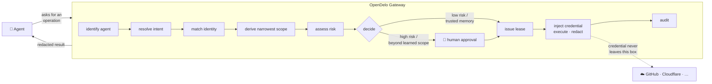

<div align="center">

# OpenDelo

**Agents get capabilities, not credentials.**

A local boundary that sits between your AI agents and the services they act on.
Every request is scoped, time-limited, audited — and refused when anything is uncertain.

[](https://go.dev)
[](https://react.dev)
[](https://sqlite.org)
[](#privacy)
[](#project-status)
[](LICENSE)

**English** · [简体中文](README.zh-CN.md)

</div>

---

## The problem

An agent that can act on your behalf needs credentials. So you give it a token —
in an environment variable, a config file, an MCP server's settings. From that moment:

- the token is in the agent's context, and therefore in the model provider's logs;
- the token carries **every** permission it was minted with, not the one you meant to grant;
- it has no expiry you control, and revoking it breaks everything else using it;
- when the agent does something you didn't expect, there is no record of *why* it was allowed.

Prompt injection makes this worse, not better: the agent reads untrusted content and
the credential is already in its hands.

## The approach

OpenDelo holds the credential and never hands it over. The agent asks for an
**operation**; OpenDelo decides, then performs it.



The agent receives the **result**, redacted. It never receives the key.

## What is guaranteed

These are enforced by architecture tests and sentinel scans, not by convention:

| | |
|---|---|
| **Credentials stay inside** | Plaintext exists only as a `secret.Value`, whose `String()`, `MarshalJSON()` and `Format()` all return `[redacted]`. The type is only permitted in two packages — a build-time test fails otherwise. Eight surfaces are scanned for leaks: agent context, environment, MCP responses, logs, temp files, console DOM, approval text, debug output. |
| **Fail closed** | Ten kinds of uncertainty — unrecognisable agent, ambiguous identity, undeclared capability, unknown risk, offline gateway, unavailable credential source, failed audit write, and three more — all resolve to *deny*. The decision path has exactly one allow-exit, so it can be reviewed in one sitting. |
| **Nothing is permanent** | `leases.expires_at` is `NOT NULL` at the schema level. "Grant forever" is not expressible. |
| **A human stays in the loop** | High-risk operations always require confirmation. No configuration turns this off, and there is no "always allow this from now on" option. |
| **Learning never widens** | Approving an action teaches a narrow memory. It may not expand resource, operation, time, agent, project, identity or environment — a convergence check runs before any memory is stored. |
| **Everything is recorded** | The audit write is a *precondition* of execution, not a side effect. There is no unaudited path. |

## Install

A single statically linked binary with the console embedded. Nothing else is
required on the target machine — no Go, no Node, no runtime.

```sh
curl -LO https://github.com/leazoot/OpenDelo/releases/latest/download/opendelo-linux-amd64
chmod +x opendelo-linux-amd64
sudo install -m 0755 opendelo-linux-amd64 /usr/local/bin/opendelo
```

Builds are published for macOS (arm64/amd64), Linux (arm64/amd64) and Windows.
Verify against `SHA256SUMS` on the release page.

> The release pipeline is in place but no tag has been cut yet, so the link above
> will 404 until the first one lands. Build from source in the meantime.

<details>
<summary>Or build from source — needs Go ≥ 1.25 and pnpm</summary>

```sh
pnpm --dir web install --frozen-lockfile
make build            # bin/opendelo, console embedded
```

Cross-compiling works from any host, since nothing links against C:

```sh
GOOS=linux GOARCH=amd64 CGO_ENABLED=0 make build
```

</details>

## Quick start

```sh
opendelo init     # create config + data dirs, 0700/0600
opendelo start    # gateway up on 127.0.0.1
```

Open the console at **http://127.0.0.1:8787**, connect a credential source and an
identity, then point an agent at the MCP endpoint:

```sh
opendelo run -- claude          # strips known credential env vars from the child
opendelo status                 # ports, version, uptime
opendelo leases                 # what is currently authorised
opendelo audit --limit 20       # the ledger
```

## The three faces

Each port authenticates independently and shares no credentials with the others.
All bind to `127.0.0.1` by default; anything else requires explicit confirmation.

| Port | Face | For | Notes |
|---:|---|---|---|
| `8787` | Web API + Console | you | Session token + mandatory `Origin` check. Serves the embedded React console. |
| `8788` | Agent Proxy | agents | Intercepts outbound calls, matches a lease, injects the credential. No lease, no traffic. |
| `8789` | MCP | agents | Streamable HTTP. Tools are generated from adapter capability declarations. |

**Agents cannot reach the approval or configuration endpoints.** That is a boundary in
the routing, not a permission setting.

## Supported today

<table>
<tr><td valign="top" width="50%">

**Services**

- GitHub — 13 declared operations
- Cloudflare — DNS records, zones
- Model APIs — OpenAI, Anthropic
- Generic HTTP — user-defined, must declare a risk level and an endpoint allowlist

</td><td valign="top" width="50%">

**Credential sources**

- macOS Keychain — via `security(1)`, no cgo
- 1Password — via the `op` CLI, argv only, never a shell string
- Local Vault — Argon2id (64 MiB / 3 / 4) + XChaCha20-Poly1305, own master password, auto-lock

</td></tr>
</table>

OpenDelo stores **references**, not secrets: a provider id, an item reference, a field
name. The only ciphertext it ever holds is the Local Vault.

## The console

Not a dashboard. The interface is built around a single vertical **boundary seam** that
stays pixel-centred at every breakpoint and in every state — outside on the left, inside
on the right, leases clipped to the inner edge.

| Page | What it is |
|---|---|
| **Gate** | Requests arriving at the seam. Approve with `A`, deny with `D`, once-only with `⇧A`. Never needs a mouse. |
| **Access Folio** | One request opened as a two-page folio: who, what, which identity, what changes, what is *not* being granted. |
| **Identities** | A relationship workbench between agents and accounts — not a password list. |
| **Rule Manuscript** | Learned authorisations as readable prose with editable inline slots, not a form. |
| **Ledger** | The local append-only record. Never uploaded, never charted. |

`⌘K` opens a command palette; every entry maps to a route or endpoint that already exists.

## Privacy

No telemetry. No analytics. No crash reporting. No fonts, icons or scripts from a CDN —
the console makes zero external requests, enforced by a CSP the gateway emits and by a
build-time scan. The ledger is appended locally and never leaves the machine.

## Project status

**In active development. Not yet released, not yet packaged.**

| | |
|---|---|
| Done | Core decision engine · persistence · credential sources · adapters · all three faces · the full web console |
| Next | End-to-end tests and packaging |
| Known gaps | No tagged release yet · no remote gateway (loopback only, by design for now) · dependency advisories pending an upgrade pass |

The decision kernel holds ≥ 85 % line coverage, `go test ./... -race` is green, and
architecture, sentinel and fail-closed suites run on every check.

## Development

```sh
make check     # gofmt · vet · golangci-lint · go test -race · typecheck · lint · vitest · build · token & CSP scans
make vuln      # govulncheck
make dev       # run without building
make help      # every target
```

| Path | Contents |
|---|---|
| `cmd/opendelo/` | The only entry point |
| `internal/transport/` | The three faces — protocol translation only, never decisions |
| `internal/core/` | The decision chain. Pure logic: no I/O, no network, no database |
| `internal/adapter/` | Outbound requests, execution, redaction |
| `internal/credential/` | Credential retrieval |
| `internal/store/` | SQLite access, migrations, queries |
| `internal/platform/` | Config, logging, errors, crypto, audit, clock, IDs |
| `web/` | The React console, embedded into the binary at build time |
| `test/` | Fixtures, sentinel scans, architecture tests |

Dependency direction is enforced in CI: `core` may not import `transport`, outbound
requests may only originate in `adapter`, and only `store` may import a database driver.
A violation fails the build.

## Contributing

Issues and discussion are welcome. Before opening a pull request, note that a few
constraints are not negotiable — they are the product, not preferences:

1. Credentials never reach the agent, the logs, the console, or an error message.
2. Uncertainty resolves to *deny*. There is no fallback that lets a request through.
3. High-risk operations always require a human.
4. Learning may not widen any dimension of an authorisation.
5. No authorisation without an expiry.
6. No execution without an audit record.
7. When the gateway is down, nothing falls back to a direct connection.

`make check` must be green, and new behaviour needs a test that fails when the behaviour
is reverted.

## License

[MIT](LICENSE) © leazoot
