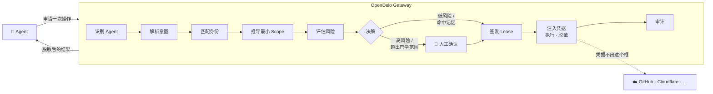

<div align="center">

# OpenDelo

**让 Agent 拿到能力，而不是凭据。**

一条本地边界，站在你的 AI Agent 与它要操作的服务之间。
每次请求都被收敛到最小范围、带期限、被审计 —— 任何不确定的状态一律拒绝。

[](https://go.dev)
[](https://react.dev)
[](https://sqlite.org)
[](#隐私)
[](#项目状态)
[](LICENSE)

[English](README.md) · **简体中文**

</div>

---

## 问题

一个能替你做事的 Agent 需要凭据。于是你给了它一个 Token —— 放进环境变量、配置文件，
或者某个 MCP 服务的设置里。从这一刻起：

- 这个 Token 进了 Agent 的上下文，也就进了模型服务的日志；
- 它带着签发时的**全部**权限，而不是你这次想给的那一点；
- 它的有效期不由你控制，撤销它会一并弄坏别的正在用它的东西；
- 当 Agent 做了你没预料到的事，没有任何记录能说明**它当时为什么被允许**。

提示注入让这件事更糟而不是更好：Agent 读到不可信的内容时，凭据已经在它手里了。

## 做法

OpenDelo 持有凭据，且从不交出去。Agent 申请的是一次**操作**；OpenDelo 决定，然后代它执行。



Agent 拿到的是脱敏后的**结果**，永远不是那把钥匙。

## 保证了什么

以下每一条都由架构测试与哨兵扫描强制，不靠自觉：

| | |
|---|---|
| **凭据留在缝内** | 明文只以 `secret.Value` 存在，它的 `String()`、`MarshalJSON()`、`Format()` 一律返回 `[redacted]`。这个类型只允许出现在两个包里，越界即构建失败。八个面被逐一扫描：Agent 上下文、环境变量、MCP 响应、日志、临时文件、Console DOM、审批信息、调试输出。 |
| **Fail Closed** | 十种不确定 —— 认不出 Agent、身份歧义、能力未声明、风险未知、网关离线、凭据源不可用、审计写入失败等 —— 全部走向拒绝。决策链路**只有一个放行出口**，一次就能审查完。 |
| **没有永久授权** | `leases.expires_at` 在 schema 层面是 `NOT NULL`。「永远允许」这件事在数据模型里根本表达不出来。 |
| **人始终在环内** | 高风险操作永远需要确认。没有任何配置组合能关掉它，也不提供「今后自动允许」这个选项。 |
| **学习不会扩大** | 同意一次操作只学到一条很窄的记忆。它不得在资源、操作、时间、Agent、项目、身份、环境任何一个维度上变宽 —— 存记忆前先跑收敛校验。 |
| **一切都被记录** | 审计写入是执行的**前置条件**，不是副作用。不存在未审计的路径。 |

## 安装

一个静态链接的单文件，Console 已内嵌。目标机器上不需要任何其他东西 ——
不需要 Go，不需要 Node，也没有运行时依赖。

```sh
curl -LO https://github.com/leazoot/OpenDelo/releases/latest/download/opendelo-linux-amd64
chmod +x opendelo-linux-amd64
sudo install -m 0755 opendelo-linux-amd64 /usr/local/bin/opendelo
```

发布覆盖 macOS（arm64/amd64）、Linux（arm64/amd64）与 Windows。
用发布页上的 `SHA256SUMS` 校验。

> 发布流程已就位并演练过，但还没有发布过版本，上面的链接在第一个版本出来之前是 404。
> 在那之前从源码构建 —— `make dist` 在本地产出同样的五个二进制。

<details>
<summary>或者从源码构建 —— 需要 Go ≥ 1.25 与 pnpm</summary>

```sh
pnpm --dir web install --frozen-lockfile
make build            # bin/opendelo，Console 已内嵌
```

因为没有任何 C 依赖，从哪台机器交叉编译都行：

```sh
GOOS=linux GOARCH=amd64 CGO_ENABLED=0 make build
```

</details>

## 快速开始

从装完到 Agent 替你做事、而它手里始终没有你的 Token，一共四步。

**1 — 起网关。**

```sh
opendelo init     # 建配置与数据目录，权限 0700/0600
opendelo start    # 三个接入面起在 127.0.0.1
```

`init` 必须先跑：`start` 不会替你造一个没让它造的数据目录。

**2 — 连一个身份。** 在 **http://127.0.0.1:8787** 打开 Console → **Identities** → 连接。
你给的是一个**坐标**，不是密文：哪个来源（钥匙串、1Password 或本地保险库）、
哪个条目、哪个字段，以及它代表哪个服务的哪个账号。坐标会被解析一次以确认它确实
指向某样东西，取到的值当场清零 —— 不显示、不记日志、不入库。

**3 — 让 Agent 从网关走。**

```sh
opendelo run -- claude
```

`run` 会把已知的凭据变量（`GITHUB_TOKEN`、`OPENAI_API_KEY` 等）从子进程环境里清掉，
换成一把会话密钥。把 Agent 的 MCP 客户端指向 `http://127.0.0.1:8789`，
工具清单由你已连接的 Adapter 生成。

**4 — 看着那条缝。** 让 Agent 读点什么 —— 一个仓库、一条 DNS 记录。低风险、
范围收敛得出来，它直接穿过去，账本上记着为什么。再让它**写**点什么：请求会停在缝前，
Gate 页面上看得见它到达。按 `A` 允许到任务结束，`⇧A` 只这一次，`D` 拒绝。
选「今后在当前项目自动允许」，同样的请求就不再问 —— 只对那个资源、那个操作、
那个项目，一寸也不多。

这就是这个产品的全部：Agent 拿到了能力，凭据留在你这里。

```sh
opendelo status                 # 端口、版本、运行时长
opendelo leases                 # 此刻有哪些授权生效
opendelo audit --limit 20       # 账本
```

## 三个接入面

三个端口各自独立认证，互不共享凭据。默认全部只监听 `127.0.0.1`，
改成别的地址需要显式确认。

| 端口 | 面 | 给谁 | 说明 |
|---:|---|---|---|
| `8787` | Web API + Console | 你 | 会话令牌 + 强制 `Origin` 校验，同时提供内嵌的 React Console。 |
| `8788` | Agent Proxy | Agent | 拦下出站调用，匹配 Lease，注入凭据。没有 Lease 就没有流量。 |
| `8789` | MCP | Agent | Streamable HTTP，工具清单由 Adapter 的能力声明生成。 |

**Agent 调不到审批与配置端点。** 这是路由上的硬边界，不是一项权限配置。

## 目前支持

<table>
<tr><td valign="top" width="50%">

**服务**

- GitHub —— 13 项已声明操作
- Cloudflare —— DNS 记录、Zone
- 模型服务 —— OpenAI、Anthropic
- 通用 HTTP —— 用户自定义，必须声明风险等级与端点白名单

</td><td valign="top" width="50%">

**凭据来源**

- macOS 钥匙串 —— 走 `security(1)`，无 cgo
- 1Password —— 走 `op` 命令行，参数数组形式，绝不拼接 shell
- 本地保险库 —— Argon2id（64 MiB / 3 / 4）+ XChaCha20-Poly1305，独立主密码，自动锁定

</td></tr>
</table>

OpenDelo 存的是**引用**而不是密钥：来源 id、条目引用、字段名。
它唯一持有过的密文是本地保险库。

## Console

这不是一个管理后台。整个界面围绕一条垂直的**边界缝**展开 ——
它在所有断点、所有状态下都精确居中，左边恒为代理侧，右边恒为受保护侧，
Lease 标签贴在缝的内侧。

| 页面 | 是什么 |
|---|---|
| **Gate** | 缝前等待的请求。`A` 允许、`D` 拒绝、`⇧A` 仅这一次，全程不需要鼠标。 |
| **Access Folio** | 一次请求摊开成一册对开文书：谁、要做什么、用哪个身份、会改变什么、以及**这次没有给出什么**。 |
| **Identities** | Agent 与账户之间的关系工作台，不是一份密码清单。 |
| **Rule Manuscript** | 学到的授权写成能读的句子，可改的地方是行内槽位而不是表单。 |
| **Ledger** | 本地追加的账本。不上传，也不画图。 |

`⌘K` 唤出命令面板；每一条都通向一个已经存在的路由或端点。

## 隐私

无遥测、无埋点、无崩溃上报。字体、图标、脚本一律本地，Console 不发出任何外部请求 ——
由网关下发的 CSP 与构建期扫描共同强制。账本只在本地追加，不离开这台机器。

## 项目状态

**功能已经完整，尚未打发布 tag。**

| | |
|---|---|
| 已完成 | 决策内核 · 持久化 · 凭据来源 · Adapter · 三个接入面 · 完整的 Web Console · 端到端与安全验收 · 性能基线 · 跨平台构建 |
| 下一步 | 打第一个发布 tag |
| 已知缺口 | 不支持远程 Gateway（当前只监听回环，是有意为之）· 一条依赖告警要等一次大版本升级 |

决策内核行覆盖率 ≥ 85%。`go test ./... -race` 全绿；架构测试、哨兵扫描与
Fail Closed 用例每次检查都跑；十条成功标准每次端到端运行都对着真实二进制跑一遍。
变更记录见 [CHANGELOG.md](CHANGELOG.md)。

## 开发

```sh
make check     # gofmt · vet · golangci-lint · go test -race · typecheck · lint · vitest · build · 令牌、CSP、包体与链接扫描
make e2e       # 真实二进制 + 本地假服务，跑在 Chromium / Firefox / WebKit 上
make bench     # 带预算的性能基线
make dist      # 交叉编译的可分发二进制 + SHA256SUMS
make vuln      # govulncheck
make dev       # 不构建直接运行
make help      # 全部 target
```

| 路径 | 内容 |
|---|---|
| `cmd/opendelo/` | 唯一入口 |
| `internal/transport/` | 三个接入面，只做协议转换，不做决策 |
| `internal/core/` | 决策链路。纯逻辑：不发网络请求、不读文件、不碰数据库 |
| `internal/adapter/` | 出站请求构造、执行与脱敏 |
| `internal/credential/` | 凭据取用 |
| `internal/store/` | SQLite 访问、迁移与查询 |
| `internal/platform/` | 配置、日志、错误、加密、审计、时钟、ID |
| `web/` | React Console，构建期内嵌进二进制 |
| `test/` | 夹具、哨兵扫描、架构测试 |

依赖方向由 CI 强制：`core` 不得 import `transport`，出站请求只能从 `adapter` 发出，
只有 `store` 可以 import 数据库驱动。违反即构建失败。

## 参与

欢迎提 Issue 与讨论。发 PR 前请注意，有几条约束不可协商 —— 它们就是这个产品本身，
不是偏好问题：

1. 凭据不到达 Agent、日志、Console，也不进错误信息。
2. 不确定即拒绝。不存在任何「出错就放行」的回退。
3. 高风险操作永远需要人。
4. 学习不得在任何一个维度上扩大授权。
5. 没有不带期限的授权。
6. 没有不留审计的执行。
7. 网关不可用时，不回退到 Agent 直连。

`make check` 必须全绿，新增行为需要一个「代码回退时会失败」的用例。

## 协议

[MIT](LICENSE) © leazoot
